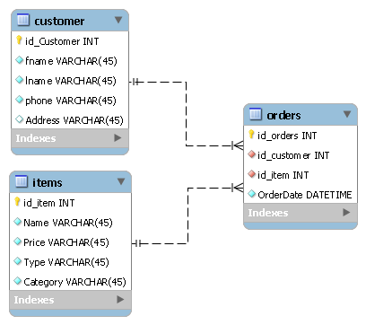

# Revature Project Zero - Oscar Garcia

&nbsp;

# Python&nbsp; | &nbsp; MySQL&nbsp; | &nbsp;CLI Restaurant App

## **Description:** placeholder

&nbsp;

## Development LifeCycle

---

&nbsp;

### 1. Plan

### 2. Design

### 3. Code

### 4. Test

### 5. Deploy

---

&nbsp;

# Tech Stack:

> ## Python 3.9.13
> ## MySQL 8.0.29
---

&nbsp;

# Packages:

&nbsp;

> ## pandas for manipulating data and read/write files
> ## sqlalchemy to create engine to import Excel file into MySQL db
> ## pymysql for database connection
> ## signal for signal handlers (kill terminal on menu quit)
> ## time for datestamps in 'created' fields
> ## tabulate for rendering data to tables in terminal
> ## os for operating system functions
> ## collections for deque
---

&nbsp;

# Project Management:

> ## Jira
> ## Agile
> ## Kanban
> ## Vs Code 1.68.0
&nbsp;

# ERR Diagram

